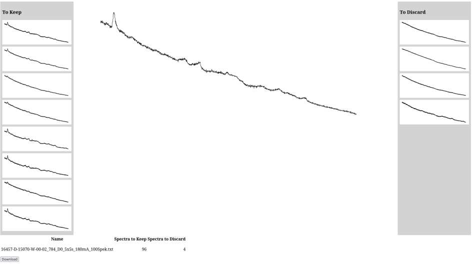

# spectrum-sorter

# Compilation / Installation

* `go build`
* `cd gui`
* `npx webpack`
* `cp dist/app.bundle ../static`

# Use
To start the software, use the following command:

`./spectrum-sorter -d /path/to/ramanData.txt`

1. Click on the name of the file to process.
2. Drag poor quality spectra from `To Keep` section to `To Discard` section. 
3. When statisfied with the sorting, click the `Download` button and save the `.json` alongside your data.